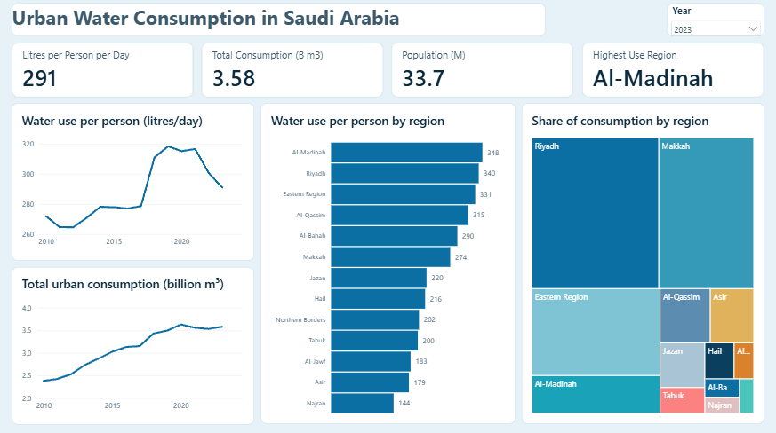
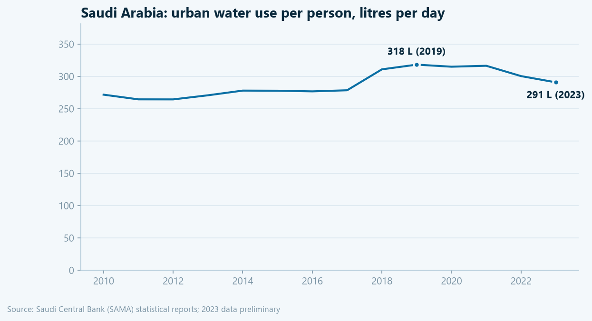
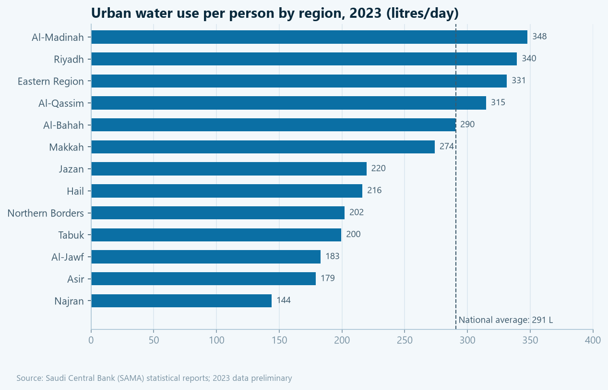
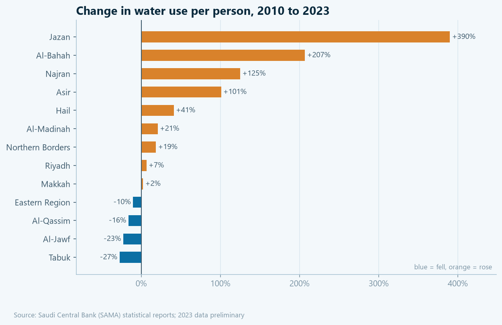
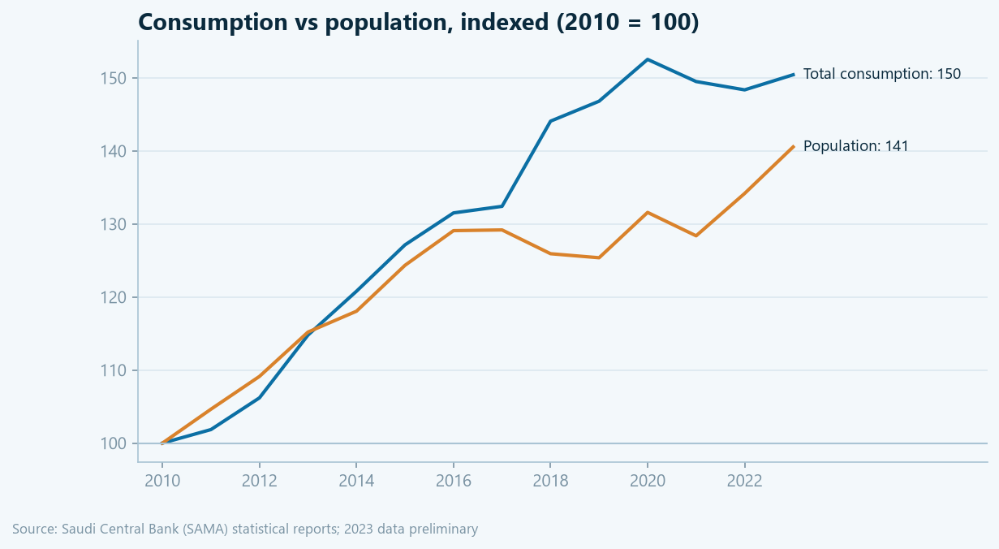
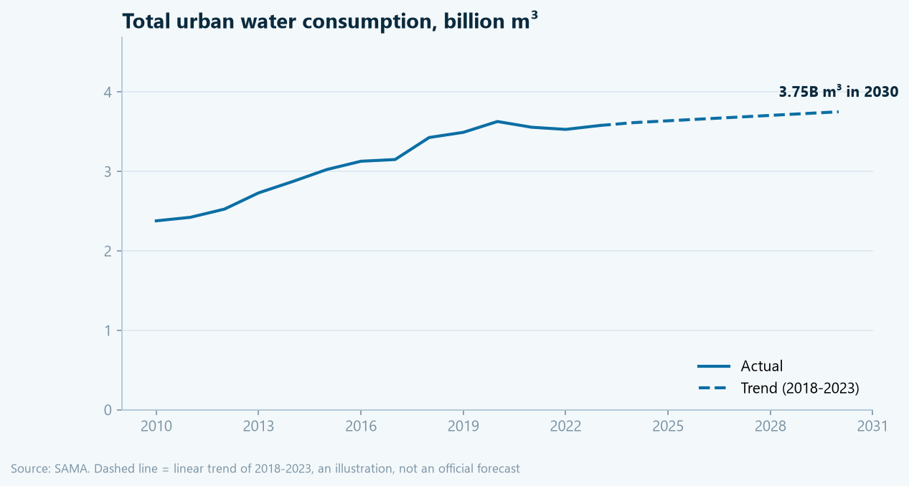

# Urban Water Consumption in Saudi Arabia's Regions (2010–2023)

A data analysis project on how much water each Saudi region uses per person, how this has changed since 2010, and where total demand is heading. Built with **Python (pandas, matplotlib)** on official data from the **Saudi Central Bank (SAMA)**.

## Key findings

| | 2010 | 2023 |
|---|---|---|
| Urban water use per person (national) | 272 L/day | **291 L/day** (peak 318 L in 2019) |
| Total urban consumption | 2.38B m³ | **3.58B m³ (+50%)** |
| Population | 24.0M | **33.7M (+41%)** |

1. **Consumption grew faster than population.** Total urban water use rose 50% between 2010 and 2023, while population rose 41%, so use per person went up.
2. **Use per person has been falling since its 2019 peak**, from 318 to 291 litres per day (-9%), in line with national conservation efforts.
3. **The gap between regions is 2.4x.** Al-Madinah (348 L), Riyadh (340 L) and the Eastern Region (331 L) use the most per person; Najran (144 L), Asir (179 L) and Al-Jawf (183 L) the least. Al-Madinah's figure is likely raised by visitors and pilgrims, who use water but are not counted in the resident population.
4. **Three regions account for 73% of all urban consumption:** Riyadh, Makkah and the Eastern Region.
5. **Southern regions are catching up fast.** Use per person rose 390% in Jazan, 207% in Al-Bahah and 125% in Najran since 2010, from a low base. This could reflect expanding water networks, which would be worth confirming with network coverage data.
6. **If the 2018–2023 trend continues, urban demand reaches about 3.75B m³ by 2030.** This is a simple linear trend for illustration, not an official forecast.

## Power BI dashboard



An interactive dashboard (`powerbi/water_dashboard.pbix`) with a custom water theme (`powerbi/water_theme.json`):

- **Year slicer:** the KPI cards, the regional ranking and the consumption shares update for the selected year, while both trend lines always show 2010–2023
- **Click any region** to filter the whole dashboard to that region
- **Per-capita measure done right:** litres per person per day is calculated as total consumption ÷ total population in DAX, not as an average of regional ratios, so the national figure is weighted correctly by population

## Python charts







## Data

Both tables were exported from the [SAMA Statistical Report](https://www.sama.gov.sa/en-US/Publications/EconomicReports/Pages/report.aspx?cid=127) portal (Other Miscellaneous Statistics):

| File in `data/raw/` | Table | Unit |
|---|---|---|
| `SAMA_StatisticalReport_04102026025940.xls` | Water Consumption in Regions of The Kingdom, 2007–2023 | thousand m³ |
| `SAMA_StatisticalReport_04102026031129.xls` | The Kingdom's Population Statistics by Administrative Regions and Sex, 2010–2024 | persons |

### Cleaning steps
- SAMA's "Excel" export is really an MHTML web page, so the tables are read with `pandas.read_html`
- **Dropped 2007–2009:** six regions are missing and several values appear shifted into the wrong column (e.g. the Eastern Region jumps from 41,572 to 417,998 between 2007 and 2008)
- Converted `-` (not available) to missing values and unified region names between the two tables (`Ha'il` → `Hail`, `Al-Baha` → `Al-Bahah`)
- Reshaped the population table (a region header row followed by Female / Male / Total rows) into one row per region per year, keeping the totals
- Calculated **litres per person per day** = consumption (thousand m³) × 1,000,000 ÷ population ÷ 365
- **Flagged suspicious values:** a region-year is flagged when it differs by more than 35% from both the year before and the year after. Two values were flagged and kept as reported: **Al-Qassim 2017** (64,505 vs ~124,000 and ~167,000 around it) and **Al-Jawf 2017** (27,591 vs ~44,000 and ~48,000)

### Validation
The national figure for 2010 (272 L/person/day) matches a peer-reviewed study that used the same SAMA source: [Regional Heterogeneity in Urban Water Consumption in Saudi Arabia (Water, 2025)](https://www.mdpi.com/2073-4441/17/8/1156).

### Output tables (`data/processed/`)
- `water_per_capita_by_region.csv`: region, year, consumption, population, litres per person per day, suspicious flag
- `water_national.csv`: the same for the whole Kingdom

## Limitations
- "Urban consumption" covers residential, commercial and public use, so per-person figures are not household use alone.
- Population figures were revised by SAMA from 2010 onwards based on the 2022 census; 2023 consumption data is preliminary.
- Visitors and pilgrims are not in the resident population, which raises per-person figures in Makkah and Al-Madinah.

## How to run

```bash
python -m venv .venv
.venv\Scripts\activate
pip install -r requirements.txt
python scripts/analysis.py
```

## Tools
Python · pandas · matplotlib · Power BI · DAX · Git

---
**Author:** Turki Alhujaili, Computer Science graduate, Taibah University
[LinkedIn](https://www.linkedin.com/in/turki-alhujaili-59189b370) · [GitHub](https://github.com/turki-alhujaili)
